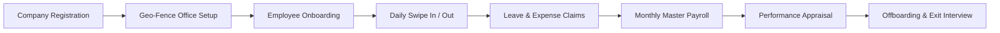

# 📘 StaffHub HRMS & Payroll System - Complete End-to-End (E2E) Documentation & Manual

---

## 📌 Executive Summary
**StaffHub** is an all-in-one, enterprise-grade Human Resource Management System (HRMS), Employee Self-Service (ESS), and Automated Payroll platform. It digitizes the end-to-end employee lifecycle—from initial company registration and employee onboarding to daily geo-fenced attendance, leave approvals, expense claims, task management, performance appraisals, master salary preparation, and offboarding exit interviews.

---

## 📑 Table of Contents
1. [Full Feature Inventory (App-Wide Matrix)](#1-full-feature-inventory-app-wide-matrix)
2. [Role-Based Architecture & Access Control](#2-role-based-architecture--access-control)
3. [Module 1: Auth, Landing & Company Registration](#module-1-auth-landing--company-registration)
4. [Module 2: HR Admin Portal & Geo-Location Management](#module-2-hr-admin-portal--geo-location-management)
5. [Module 3: Employee Self-Service (ESS) Portal](#module-3-employee-self-service-ess-portal)
6. [Module 4: Payroll & Financial Compensation Engine](#module-4-payroll--financial-compensation-engine)
7. [Module 5: Work & Task Management (Kanban System)](#module-5-work--task-management-kanban-system)
8. [Module 6: SuperAdmin & Developer Portal](#module-6-superadmin--developer-portal)
9. [End-to-End Workflows & User Flow Diagrams](#end-to-end-workflows--user-flow-diagrams)

---

## 1. Full Feature Inventory (App-Wide Matrix)

Below is the complete list of all **35+ active features** present in StaffHub UI:

| Feature Name | Route Path | Access Role | Description & Capability |
| :--- | :--- | :--- | :--- |
| **Landing Page** | `/landing` | Public | Marketing landing page with hero banner & feature highlights. |
| **Register Company** | `/register-company` | Public | Onboard new company with name, domain, HR contact & address. |
| **User Login** | `/login` | Public | Secure JWT authentication with role-based dashboard redirect. |
| **Forgot Password** | `/forgot-password` | Public | Self-service password recovery flow via email OTP. |
| **ESS Dashboard** | `/ess/ess-dashboard` | Employee | Personal portal overview: Punch widget, leave summary, tasks. |
| **Employee Attendance** | `/ess/employee-attendance` | Employee | Daily Swipe In/Out with real-time GPS & Meter Distance check. |
| **My Assets** | `/ess/my-assets` | Employee | View assigned laptops, SIMs, monitors & request new hardware. |
| **Attendance Regularization** | `/ess/attendance-regularization` | Employee | Request punch corrections for missed swipes or field work. |
| **Leave Application** | `/ess/leave-application` | Employee | Apply Casual/Sick/Earned leaves with live balance counter. |
| **Apply Short Leave** | `/ess/apply-short-leave` | Employee | Request 2-hour or half-day short leaves with manager alert. |
| **Monthly Attendance Calendar** | `/ess/monthly-attendance-calendar` | Employee | Visual color-coded attendance grid (Present, Absent, Leave). |
| **Final Attendance** | `/ess/final-attendance` | Employee / HR | View monthly aggregated attendance summary & payable days. |
| **Employee Resignation** | `/ess/employee-resignation` | Employee | Submit formal resignation and track notice period days. |
| **Reporting Team Attendance** | `/ess/reportings-attendance` | Manager | Managers view team members' daily attendance status. |
| **Holiday List** | `/ess/holiday-list` | All Users | Official annual holiday calendar with gazetted & restricted holidays. |
| **Digital Service File** | `/ess/service-file` | Employee | Digital employee service record, promotion & appraisal history. |
| **Get Employee Info** | `/ess/get-employee-info` | All Users | Company directory search with contact info & org hierarchy. |
| **Exit Interview** | `/ess/exit-interview` | Employee | Fill feedback questionnaire during notice period offboarding. |
| **Expense Management** | `/ess/expense-management` | Employee | Submit reimbursement claims with attached bill receipts. |
| **Performance Management** | `/ess/performance-management` | Employee / HR | Self-KPI rating, manager reviews, and appraisal tracking. |
| **Probation Tracker** | `/ess/probation` | Employee / HR | Track remaining probation days & confirmation approval status. |
| **Support Tickets** | `/ess/ticket` | Employee | Raise IT/HR helpdesk tickets and converse with admin. |
| **Work Task Management** | `/ess/task-management` | All Users | Drag-and-drop Kanban task board with priority & due dates. |
| **Onboarding Profile** | `/ess/onboarding` | Employee | Step-by-step submission of bank, identity & personal details. |
| **Manage Profile** | `/ess/manage-profile` | Employee | Edit profile avatar, contact details & emergency contacts. |
| **HR Admin Dashboard** | `/hradmin/hradmin-dashboard` | HR Admin | Executive metrics: Active staff, present today, pending approvals. |
| **Employee Management** | `/hradmin/employee-management` | HR Admin | Add/Edit staff, assign roles, de-activate account, manage department. |
| **Leave Approvals** | `/hradmin/leave-approval` | HR Admin / Mgr | Approve/Reject leave requests with comments. |
| **Employee Leave Management**| `/hradmin/employee-leave-management`| HR Admin | Assign annual leave quotas & manual leave balance overrides. |
| **Employee Monthly Calendar** | `/hradmin/employee-calendar` | HR Admin | Company-wide monthly attendance matrix view. |
| **HR Attendance Reports** | `/hradmin/reports` | HR Admin | Export late mark, absent, and monthly attendance reports. |
| **Resignation Approvals** | `/hradmin/resignation-approvals` | HR Admin | Review resignation submissions, set last working day (LWD). |
| **Exit Interview Submissions** | `/hradmin/exit-interviews` | HR Admin | Analytics on exit interview feedback & resignation causes. |
| **Manage Attendance Calendar** | `/hradmin/monthly-attendance-calendar`| HR Admin | Lock monthly attendance before payroll processing. |
| **Offboarding Management** | `/hradmin/offboarding` | HR Admin | Multi-department No-Dues clearance & final settlement sync. |
| **Approval Attendance Reg.** | `/hradmin/approval-attendance-regularization`| HR Admin | Review & approve out-of-bound or missed punch requests. |
| **Office Location Settings** | `/hradmin/office-location-settings` | HR Admin | Define Office GPS, Allowed Distance Radius (meters) & WFH rules. |
| **Device Management** | `/hradmin/device-management` | HR Admin | Authorize employee mobile devices & laptop MAC addresses. |
| **Asset Approvals** | `/hradmin/asset-approval` | HR Admin | Approve hardware allocation & track device recovery. |
| **Payroll Dashboard** | `/payroll/payroll-dashboard` | Payroll Admin | Financial overview: Monthly payroll budget, gross pay, deductions. |
| **Master Salary Preparation** | `/payroll/employee-salary-preparation` | Payroll Admin | Prepare salary for any/all employees linked with attendance. |
| **Monthly Salary Components**| `/payroll/monthly-salary-components` | Payroll Admin | Configure earnings/deductions rules (Basic, HRA, PF, ESI, TDS). |
| **Yearly Salary Components** | `/payroll/yearly-salary-components` | Payroll Admin | Annual CTC breakup & Form 16 component configuration. |
| **Employee Expense Statement**| `/reports/employee-expense-statement` | Payroll Admin | Audit trail of approved expense reimbursements for payouts. |

---

## 2. Role-Based Architecture & Access Control

StaffHub enforces strict data boundary and menu access based on assigned roles:

```
                  +-----------------------------------+
                  |           SUPER ADMIN             |
                  | (Multi-Tenant & Developer Logs)   |
                  +-----------------------------------+
                                    |
                  +-----------------------------------+
                  |             HR ADMIN              |
                  | (Location, Employees, Approvals)  |
                  +-----------------------------------+
                                    |
          +-------------------------+-------------------------+
          |                                                   |
+-------------------+                               +-------------------+
|  PAYROLL MANAGER  |                               |     EMPLOYEE      |
| (Salary & Expenses)|                               | (ESS, Swipe, Task)|
+-------------------+                               +-------------------+
```

---

## Module 1: Auth, Landing & Company Registration

### 1.1 Company Self-Registration (`/register-company`)
* **Flow**: New clients enter Company Name, Corporate Email, Industry, Employee Count, and Address.
* **Outcome**: Automatically creates Company Tenant, default HR Admin account, and initializes default Leave & Attendance policies.

### 1.2 User Login & Profile Management (`/login`, `/ess/manage-profile`)
* **Security**: JWT-token based session auth. Password encryption & role-based route guards (`authGuard`, `guestGuard`).
* **Profile**: Dynamic avatar image upload, personal details editing, and emergency contact registry.

---

## Module 2: HR Admin Portal & Geo-Location Management

### 2.1 Office Location Settings & Geo-Fencing Radius (`/hradmin/office-location-settings`)

> [!IMPORTANT]
> **Core Highlight Feature**: HR Admin sets exact Office Address, Latitude, Longitude, and **Allowed Distance Radius in Meters** (e.g. `100 meters`).

* **Exemption Rules**: Define Work From Home (WFH), Client Visit, or Outstation exemptions for specific employees or departments.
* **Distance Meter Validation**: When employees click Swipe In on ESS, browser fetches real-time GPS:
  - `Distance <= Allowed_Meters` ➔ **Approved Immediately**
  - `Distance > Allowed_Meters` ➔ **Blocked / Regularization Prompt**

### 2.2 Employee Management & Lifecycle (`/hradmin/employee-management`)
* Add new staff members, edit designation, assign reporting managers.
* Track Employee Status: *Active*, *On Probation*, *Notice Period*, *Terminated*.

### 2.3 Offboarding & Exit Interviews (`/hradmin/offboarding`, `/hradmin/exit-interviews`)
* Resignation approval workflow with Last Working Date (LWD) selection.
* Digital Exit Interview questionnaire collection and analytics.
* No-Dues clearance across IT, Admin, Finance, and HR departments.

---

## Module 3: Employee Self-Service (ESS) Portal

### 3.1 Daily Geo-Fenced Swipe In / Swipe Out (`/ess/employee-attendance`)
* **Live GPS Fetch**: One-click Punch In fetches real-time latitude & longitude.
* **Distance Indicator**: Shows live distance in meters from office center point.
* **Shift Duration Counter**: Live timer tracking gross working hours and break times.

### 3.2 Leave & Short-Leave Management (`/ess/leave-application`, `/ess/apply-short-leave`)
* Real-time leave balance breakdown (Casual Leave, Sick Leave, Earned Leave).
* Short Leave application for 2-hour or half-day absence with instant manager notification.

### 3.3 Expense Reimbursement Claims (`/ess/expense-management`)
* Upload travel, food, and office supply receipts.
* Real-time claim status tracking (*Submitted ➔ Approved by HR ➔ Disbursed in Payroll*).

---

## Module 4: Payroll & Financial Compensation Engine

### 4.1 Master Salary Preparation (`/payroll/employee-salary-preparation`)
* Prepare monthly salary for **any individual employee or bulk department**.
* Automatically fetches locked attendance days, LWP (Leave Without Pay), and overtime.
* Instant breakdown:
  $$\text{Net Salary} = (\text{Basic} + \text{HRA} + \text{Allowances} + \text{Expenses}) - (\text{PF} + \text{ESI} + \text{TDS} + \text{LWP Deductions})$$

### 4.2 Salary Components & Expense Statements (`/payroll/monthly-salary-components`, `/reports/employee-expense-statement`)
* Flexible formula definitions for earnings and statutory deductions.
* Expense audit trail linking approved claims directly to payroll disbursement sheets.

---

## Module 5: Work & Task Management (Kanban System)

### 5.1 Dynamic Kanban Board (`/ess/task-management`)
* Columns: *To Do*, *In Progress*, *Under Review*, *Completed*.
* Drag-and-drop task movement, due date alerts, priority flags (High/Medium/Low), and team member assignment.

---

## End-to-End Workflows & User Flow Diagrams

### 🔄 Flow 1: Full Employee Lifecycle Journey



---
*Documentation stored in `src/assets/docs/staffhub_e2e_user_documentation.md` for project distribution.*
